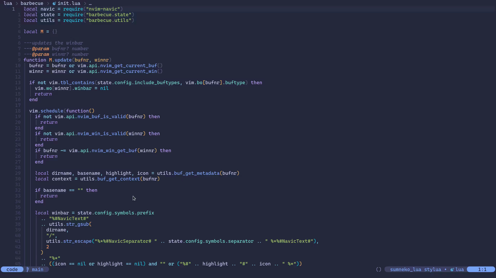

<h1 align="center">Barbecue</h1>

<p align="center">
  This is a vscode like winbar that uses
  <a href="https://github.com/SmiteshP/nvim-navic">nvim-navic</a>
  in order to get lsp context from your language server.
</p>



## 📦 Dependencies

- [Nvim v0.8.0](https://github.com/neovim/neovim/releases/tag/v0.8.0): For winbar support.
- [lspconfig](https://github.com/neovim/nvim-lspconfig): Needed by nvim-navic.
- [nvim-navic](https://github.com/smiteshp/nvim-navic): Used to get lsp context information.
- [nvim-web-devicons](https://github.com/kyazdani42/nvim-web-devicons): Install to optionally show file icon.

## 📬 Installation

Install barbecue and its dependencies

- With packer

```lua
use {
  "utilyre/barbecue.nvim",
  requires = {
    "neovim/nvim-lspconfig",
    "smiteshp/nvim-navic",
    "kyazdani42/nvim-web-devicons", -- optional
  },
}
```

- With vim-plug

```vim
Plug 'utilyre/barbecue.nvim'

Plug 'neovim/nvim-lspconfig'
Plug 'smiteshp/nvim-navic'
Plug 'kyazdani42/nvim-web-devicons' " optional
```

Then call the setup function from somewhere in your config

```lua
local barbecue = require("barbecue")
barbecue.setup()
```

At last, attach nvim-navic to any language server you want to (e.g. tsserver)

```lua
local lspconfig = require("lspconfig")
local navic = require("nvim-navic")

lspconfig.tsserver.setup({
  -- ...

  on_attach = function(client, bufnr)
    -- ...

    if client.server_capabilities.documentSymbolProvider then
      navic.attach(client, bufnr)
    end

    -- ...
  end,

  -- ...
})
```

## 🚠 Configuration

**NOTE**: nvim-navic is configured through barbecue's setup so you don't need
to (and should not) call its setup function.

<details>
  <summary>Click to see default config</summary>

  ```lua
  local barbecue = require("barbecue")

  barbecue.setup({
    ---whether to create winbar updater autocmd
    ---@type boolean
    create_autocmd = true,

    ---buftypes to enable winbar in
    ---@type table
    include_buftypes = { "" },

    ---filetypes not to enable winbar in
    ---@type table
    exclude_filetypes = { "toggleterm" },

    ---returns a string to be shown at the end of winbar
    ---@param bufnr number
    ---@return string
    custom_section = function(bufnr)
      return ""
    end,

    ---:help filename-modifiers
    modifiers = {
      ---@type string
      dirname = ":~:.",

      ---@type string
      basename = "",
    },

    symbols = {
      ---string to be shown at the start of winbar
      ---@type string
      prefix = " ",

      ---entry separator
      ---@type string
      separator = "",

      ---string to be shown when buffer is modified
      ---@type string
      modified = "",

      ---string to be shown when context is available but empty
      ---@type string
      default_context = "…",
    },

    ---icons for different context entry kinds
    kinds = {
      ---@type string
      File = "",

      ---@type string
      Package = "",

      ---@type string
      Module = "",

      ---@type string
      Namespace = "",

      ---@type string
      Macro = "",

      ---@type string
      Class = "",

      ---@type string
      Constructor = "",

      ---@type string
      Field = "",

      ---@type string
      Property = "",

      ---@type string
      Method = "",

      ---@type string
      Struct = "",

      ---@type string
      Event = "",

      ---@type string
      Interface = "",

      ---@type string
      Enum = "",

      ---@type string
      EnumMember = "",

      ---@type string
      Constant = "",

      ---@type string
      Function = "",

      ---@type string
      TypeParameter = "",

      ---@type string
      Variable = "",

      ---@type string
      Operator = "",

      ---@type string
      Null = "",

      ---@type string
      Boolean = "",

      ---@type string
      Number = "",

      ---@type string
      String = "",

      ---@type string
      Key = "",

      ---@type string
      Array = "",

      ---@type string
      Object = "",
    },
  })
  ```
</details>

---

In order to customize the autocmd behavior, you need to override `barbecue`
augroup (or ideally set `create_autocmd` to false and completely handle it
yourself) like so

```lua
vim.api.nvim_create_autocmd({
  "BufWinEnter",
  "BufWritePost",
  "CursorMoved",
  "CursorMovedI",
  "TextChanged",
  "TextChangedI",
  -- add more events here
}, {
  group = vim.api.nvim_create_augroup("barbecue", {}),
  callback = function(a)
    require("barbecue").update(a.buf)

    -- maybe a bit more logic here
  end,
})
```

## 🎨 Highlight Groups

It's basically the same as nvim-navic.

**NOTE**: You don't need to worry about these as long as your colorscheme
either supports nvim-navic itself or nvim-cmp.

- `NavicIconsFile`
- `NavicIconsModule`
- `NavicIconsNamespace`
- `NavicIconsPackage`
- `NavicIconsClass`
- `NavicIconsMethod`
- `NavicIconsProperty`
- `NavicIconsField`
- `NavicIconsConstructor`
- `NavicIconsEnum`
- `NavicIconsInterface`
- `NavicIconsFunction`
- `NavicIconsVariable`
- `NavicIconsConstant`
- `NavicIconsString`
- `NavicIconsNumber`
- `NavicIconsBoolean`
- `NavicIconsArray`
- `NavicIconsObject`
- `NavicIconsKey`
- `NavicIconsNull`
- `NavicIconsEnumMember`
- `NavicIconsStruct`
- `NavicIconsEvent`
- `NavicIconsOperator`
- `NavicIconsTypeParameter`
- `NavicText`
- `NavicSeparator`

## 📓 Todo

- [x] Add a preview gif in the readme.
- [ ] Add `barbecue.nvim` help tag.
